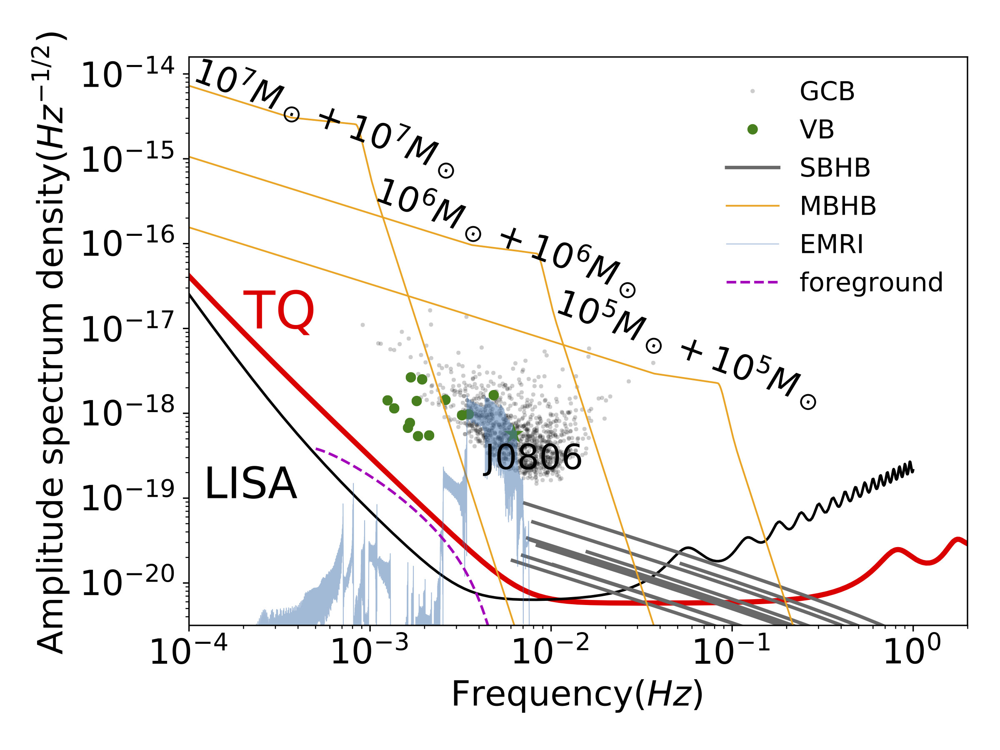
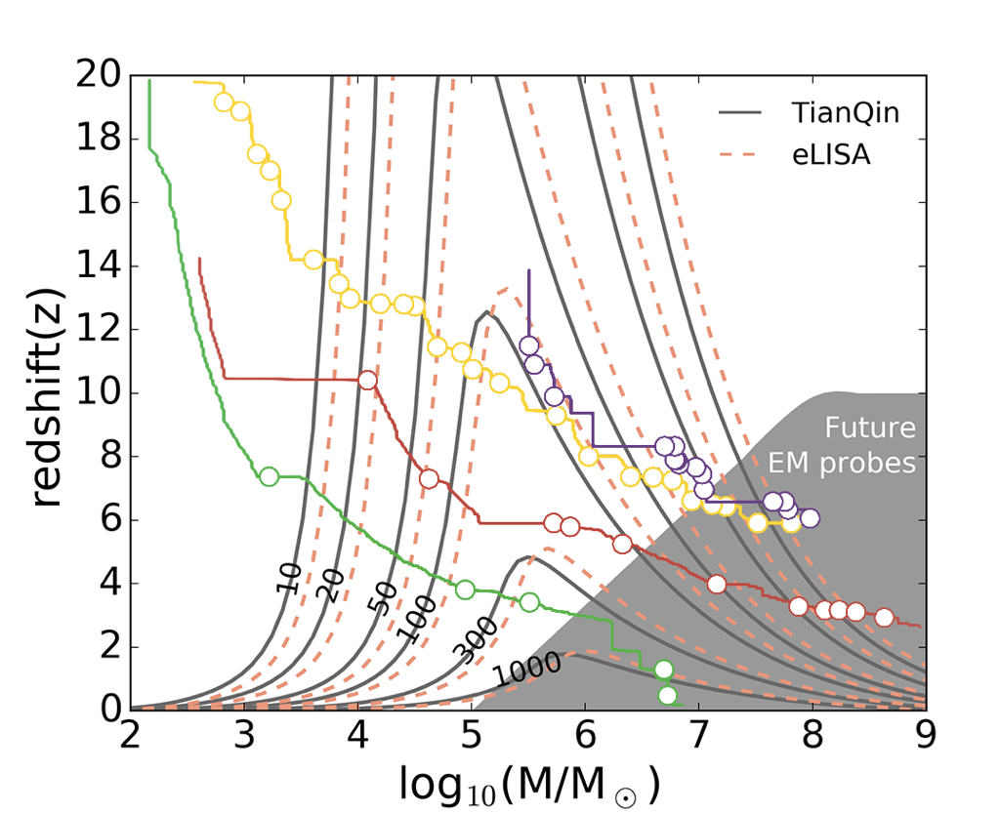

# About this directory

This directory contains useful materials about TianQin.

[Luo_2016_Class._Quantum_Grav._33_035010.pdf](Luo_2016_Class._Quantum_Grav._33_035010.pdf) is the original proposal paper for the TianQin mission.

[Mei_ptaa114.pdf](Mei_ptaa114.pdf) is a more updated standard reference for the progress of the mission.

[20200901ScienceW_TQ.pdf](20200901ScienceW_TQ.pdf) is a slide that was presented in 13th LISA symposium in 2020 to summarise the TianQin astronomy studies.

 
[AllSources.png](AllSources.png) is a figure to summarise the expected TianQin sources, their typical waveforms and comparison to TQ sensitivity. It was published in [Mei_ptaa114.pdf](Mei_ptaa114.pdf) (please cite [Mei et al. PTEP 2021 (2021) 5, 05A107](https://inspirehep.net/literature/1813026) when applicable).

 
[Range_vs_mass_addMBH4.png](Range_vs_mass_addMBH4.png) shows the horizon distance versus chirp mass (assuming quasi-circular orbit, setting mass ratio equals to 1). It was published in [Hu et al. Natl.Sci.Rev. 4 (2017) 5, 683-684] (https://inspirehep.net/literature/1712805) (please cite when applicable).

The "TQ_ASD*.txt" files corresponds to the ASD of TianQin.
SkyAverage means that the average of antenna pattern over the whole sky (a factor of 1/5) is adopted so is more conservative.
