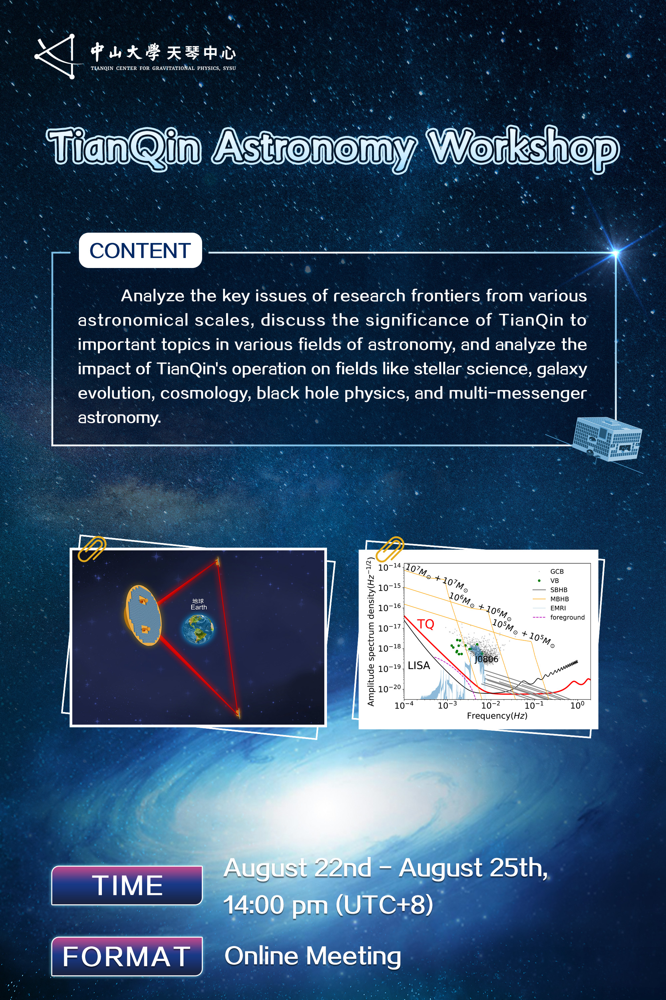
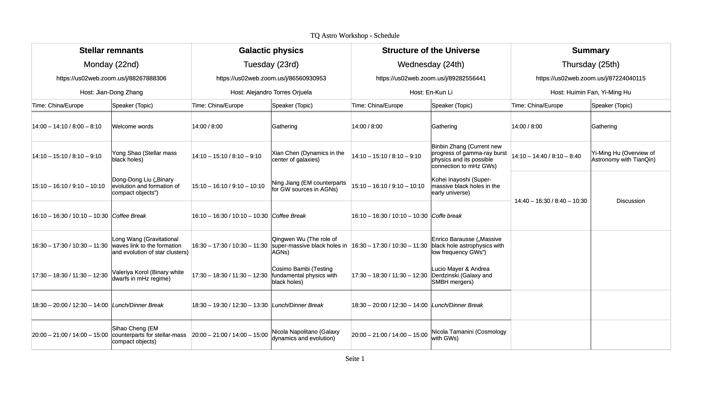

# TianQin astronomy workshop

The official website page in TianQin center is [here](https://tianqin.sysu.edu.cn/event/480), however, this github page contains more useful materials.

## Background:
This site is aim to host necessary information for the TianQin astronomy workshop for 22nd-25th August, 2022.

The meeting will be mostly held online through Zoom.

We will update the link later.

For a brief introduction of TianQin and current studies of TianQin astronomy (albeit slightly outdated), please check out [this youtube link](https://www.youtube.com/watch?v=936epPqskPU) or [this Bilibili link](https://www.bilibili.com/video/BV1f54118788/).

The corresponding slide can be found in [here](https://github.com/yiminghu-SYSU/TQ_Astro_Workshop/blob/main/InfoTianQin/20200901ScienceW_TQ.pdf)

## Puporse of the workshop
This workshop is intended to foster discussion and research activity of gravitational wave astronomy associated with the anticipated space-borne GW mission,  [TianQin](https://en.wikipedia.org/wiki/TianQin). 

For more information about TianQin, you can visit [the official website of TianQin center](https://tianqin.sysu.edu.cn/) (in Chinese).

You can also check out [the mission proposal paper](InfoTianQin/Luo_2016_Class._Quantum_Grav._33_035010.pdf) or [the official paper on recent progress](InfoTianQin/Mei_ptaa114.pdf)

We have collected slides from presenters and we encourage all to [take a look](slides) before the discussion. 
We also asked presenters to share a number of open questions, they are summarised in the end.

The [InfoTianQin](InfoTianQin) directory contains useful materials about TianQin.
We encourage our astronomer friends to have a glance.

## Collected Questions 

Xian Chen:
1. The ability/advantage of TianQin to detect eccentric stellar-mass binary black holes 
2. Improvement of sky localization by joint observation with LISA
3. The benefit of increasing the observation duration of a source if TianQin and LISA are launched at different times and not have any overlap

Tong Liu:
1. How TianQin can reshape our understanding of star collapse through TianQin's observation of nearby outbursts like supernovae, GRB, etc. 

Yong Shao:
1. Can we plot figures similar to those in arXiv:2203.06016 and arXiv:2111.08717 that clearly show the horizon distance for different types of TianQin sorces
2. Is a SNR threshold of 5 appropriate for galactic BBHs as suggested by Huang et al (2020)

Valeriya Korol:
1. What approach is TianQin planning to undertake for the data analysis
2. What precision in the parameter estimation of binaries can we expect for TianQin 

Long Wang:
1. What is the ability of TianQin to detect binary black hole mergers and measure their parameters
2. Is TianQin planning to collaborate with ground-based detectors for multiband observations

Enrico Barausse:
1. Can we decrease the uncertainty on the predicted MBH merger rate? Use EM observations to constrain astro models?  
2. Synergies with PTA/ground based?
3. How well can the MBHB eccentricity be constrained? Can we develop sufficiently accurate eccentric waveforms?
4. Can we discriminate between astro models for MBHs?

## Link to the call
Please go to the [Agenda page](Agenda) for the links of the workshop. Be aware that the link changes on a daily base so talks on different days have different links.

